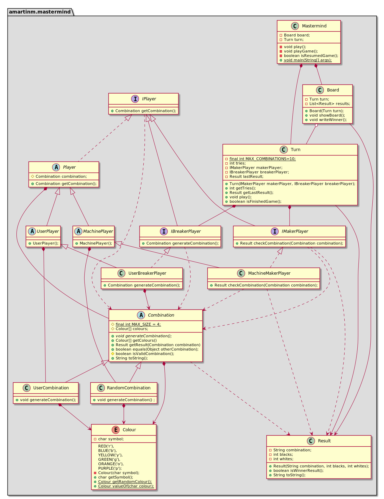

<!DOCTYPE html>
<html lang="en">
<head>
<meta charset="UTF-8">
<meta http-equiv="X-UA-Compatible" content="IE=edge">
<meta name="viewport" content="width=device-width, initial-scale=1.0">
<meta name="generator" content="Asciidoctor 2.0.8">
<meta name="author" content="Álvaro Martín Martín">
<link rel="stylesheet" href="https://fonts.googleapis.com/css?family=Open+Sans:300,300italic,400,400italic,600,600italic%7CNoto+Serif:400,400italic,700,700italic%7CDroid+Sans+Mono:400,700">
<link rel="stylesheet" href="https://cdnjs.cloudflare.com/ajax/libs/font-awesome/4.7.0/css/font-awesome.min.css">
</head>
<body class="book">

<h1>Master Mind. Solución 1.1. <strong>domainModel</strong></h1>

Álvaro Martín Martín 
<a href="mailto:amartinm82@gmail.com">amartinm82@gmail.com</a> 
version 0.0.1

Índice

<ul class="sectlevel1">
<li><a href="#domain-model"><strong>Domain model</strong></a></li>
<li><a href="#requisites-1">1. <strong>Basic</strong> Requisites </a></li>
<li><a href="#logic-design-view">Logic/Design view</a>
<ul class="sectlevel2">
<li><a href="#architecture">Architecture</a></li>
<li><a href="#mastermind-package"><em>Mastermind</em> package</a></li>
</ul>
</li>
<li><a href="#software-quality">Software quality</a>
<ul class="sectlevel2">
<li><a href="#redesign">Redesign</a></li>
</ul>
</li>
<li><a href="#development-implementation-view">Developmnet/Implementation view</a></li>
<li><a href="#physical-deployment-view">Physical/Deployment view</a></li>
<li><a href="#process-view">Process view</a></li>
<li><a href="#instructions">Instructions</a>
<ul class="sectlevel2">
<li><a href="#install">Install</a></li>
<li><a href="#usage">Usage</a></li>
<li><a href="#tests">Run tests</a></li>
</ul>
</li>
</ul>

<h2 id="domain-model">Domain model</h2>

<h2 id="requisites-1">1. <strong>Basic</strong> Requisites</h2>

<table class="tableblock frame-all grid-all stretch">
<colgroup>
<col style="width: 50%;">
<col style="width: 50%;">
</colgroup>
<tbody>
<tr>
<td class="tableblock halign-left valign-top">

<ul>
<li>
<a href="https://en.wikipedia.org/wiki/Mastermind_(board_game)"><strong>Wiki</strong></a> - <a href="https://www.youtube.com/watch?v=2-hTeg2M6GQ"><strong>Youtube</strong></a>

<ul>
<li>

<em>Funcionality: <strong>Basic</strong></em>

</li>
<li>

<em>Interface: <strong>Text</strong></em>

</li>
<li>

<em>Distribution: <strong>Stand Alone</strong></em>

</li>
<li>

<em>Persistence: <strong>No</strong></em>

</li>
</ul>

</li>
</ul>

</td>
<td class="tableblock halign-left valign-top">

</td>
</tr>
</tbody>
</table>

<h2 id="logic-design-view">Logic/Design view</h2>

<ul>
<li>

 Application of the <strong> Domain Model </strong> through <strong> Formal Analysis </strong>, <strong> Classic Analysis </strong>, <strong> Domain Expert </strong>, <strong> Distribution of Responsibilities </strong>, &#8230;&#8203;

</li>
</ul>

<h3 id="architecture">Architecture</h3>

<h3 id="mastermind-package"><em>Mastermind</em> package</h3>

<h2 id="software-quality">Software Quality</h2>

<h3 id="Redesign">Redesign</h3>

<ul>
<li>

<em>New interface: Graphic</em>

<ul>
<li>

<em><strong>Large classes</strong>:Models take responsibility and grow in lines, methods, attributes, &#8230;&#8203; with each new technology</em>

</li>
<li>

<em><strong> High coupling </strong>: Models with each new interface technology (console, graphics, web,&#8230;&#8203;)</em>

</li>
<li>

<em><strong> Low cohesion </strong>: each Model is managing its attributes and interface technologies</em>

</li>
<li>

<em><strong>Open/Close</strong>: You have to modify the models that were previously working to choose one view technology or another (nested if&#8217;s)</em>

</li>
</ul>

</li>
<li>

<em>New Functionalities: undo / redo, demo, statistics,&#8230;&#8203;</em>

<ul>
<li>

<em><strong> Large Classes </strong>: Models take responsibility and grow in lines, methods, attributes,&#8230;&#8203; with the new functionalities</em>

</li>
<li>

<em><strong>Open/Close</strong>: you have to modify the models that were previously working to incorporate new functionalities</em>

</li>
</ul>

</li>
</ul>

<h2 id="development-implementation-view">Development/Implementation view</h2>

<h2 id="physical-deployment-view">Deployment/Physical View</h2>

<h2 id="process-view">Process view</h2>

<ul>
<li>

There is not concurrency

</li>
</ul>

<h2 id="instructions">Instructions</h2>

<h3 id="install">Install</h3>

<ul>
<li>

<em>mvn install</em>

</li>
</ul>

<h3 id="usage">Usage</h3>

<ul>
<li>

<em>mvn package</em>

</li>
<li>

<em>java -jar target/mastermind-1.0-SNAPSHOT.jar</em>

</li>
</ul>

<h3 id="tests">Run tests</h3>

<ul>
<li>

<em>mvn test</em>

</li>
</ul>

## Author

👤 **Álvaro Martín**

* Github: [@amartinm82](https://github.com/amartinm82)

Note that you should have to [install JDK 8](http://www.oracle.com/technetwork/java/javase/downloads/jdk8-downloads-2133151.html) and [Maven](https://maven.apache.org/install.html) as prerequisite.

Version 0.0.1 
Last updated 2020-10-05 20:47:29 +0200

</html>